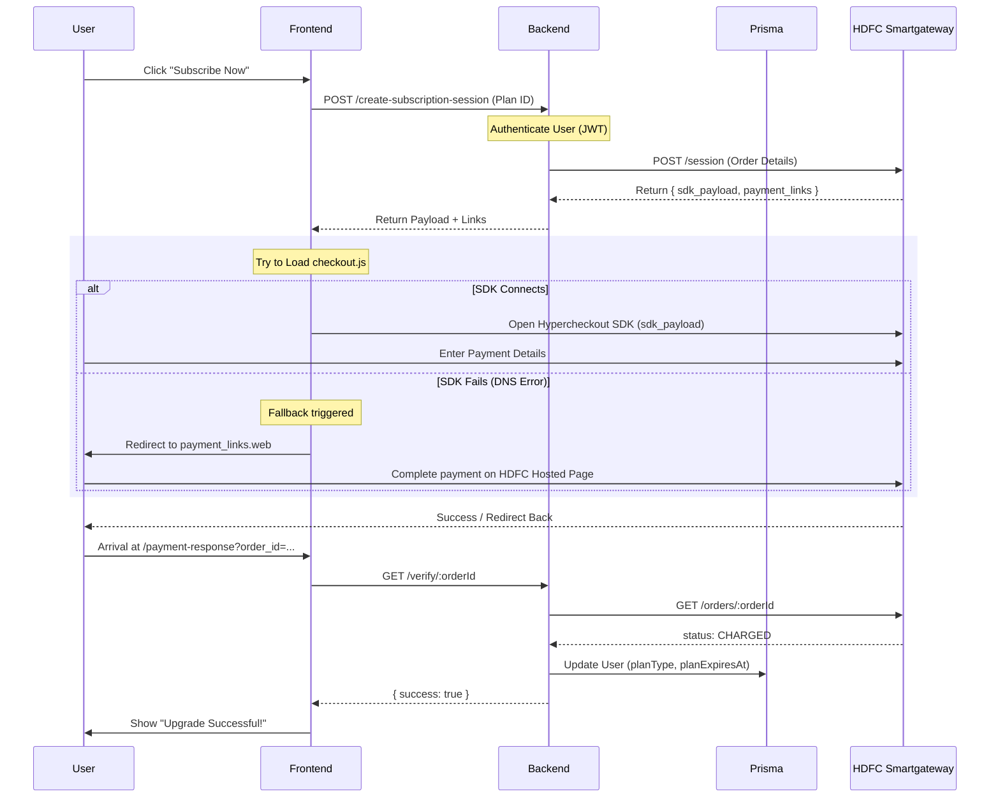

# Payment Flow Architecture

This diagram explains how the BillSoft platform handles subscription upgrades using HDFC Smartgateway with built-in resilience.

```mermaid
sequenceDiagram
    participant User
    participant Frontend
    participant Backend
    participant Prisma
    participant HDFC as HDFC Smartgateway

    User->>Frontend: Click "Subscribe Now"
    Frontend->>Backend: POST /create-subscription-session (Plan ID)
    Note over Backend: Authenticate User (JWT)
    Backend->>HDFC: POST /session (Order Details)
    HDFC-->>Backend: Return { sdk_payload, payment_links }
    Backend-->>Frontend: Return Payload + Links
    
    rect rgb(240, 240, 255)
        Note over Frontend: Try to Load checkout.js
        alt SDK Connects
            Frontend->>HDFC: Open Hypercheckout SDK (sdk_payload)
            User->>HDFC: Enter Payment Details
        else SDK Fails (DNS Error)
            Note over Frontend: Fallback triggered
            Frontend->>User: Redirect to payment_links.web
            User->>HDFC: Complete payment on HDFC Hosted Page
        end
    end

    HDFC-->>User: Success / Redirect Back
    User->>Frontend: Arrival at /payment-response?order_id=...
    Frontend->>Backend: GET /verify/:orderId
    Backend->>HDFC: GET /orders/:orderId
    HDFC-->>Backend: status: CHARGED
    Backend->>Prisma: Update User (planType, planExpiresAt)
    Backend-->>Frontend: { success: true }
    Frontend->>User: Show "Upgrade Successful!"
```
